# Algorithms

ThrottleKit is designed to be extensible with different rate-limiting algorithms.

The default implementation uses a **Fixed Window Counter**.

## Fixed Window Counter

This algorithm counts the number of requests in a fixed time window (e.g., a minute or an hour).

- **How it works:** For each key (e.g., an IP address), the system stores timestamps of their requests. When a new request comes in, it counts how many timestamps fall within the last `N` seconds (the window). If the count is less than the limit, the request is allowed and a new timestamp is added.
- **Pros:** Simple to implement and understand.
- **Cons:** Can lead to a burst of traffic at the edge of a window. For example, if the limit is 100 requests/hour, a user could make 100 requests at 11:59 and another 100 at 12:00, effectively making 200 requests in a very short period.

```mermaid
gantt
    title Fixed Window Example (Limit: 3/minute)
    dateFormat  ss
    axisFormat %S
    section Window 1 (0-60s)
    Request 1: 0, 1s
    Request 2: 15, 1s
    Request 3: 30, 1s
    Request 4 (Blocked): 45, 1s
    section Window 2 (60-120s)
    Request 5: 61, 1s
    Request 6: 62, 1s
    Request 7: 63, 1s
    Request 8 (Blocked): 64, 1s
```

Future versions may include other algorithms like:

- **Sliding Window Log**
- **Token Bucket**
- **Leaky Bucket**
